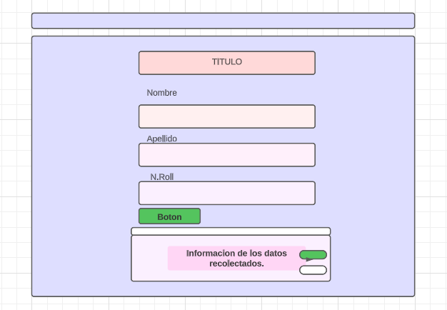

# Registro de Estudiantes

EL presente proyecto fue diseñado con fines educativos, ya se realizocon el finde facilitar el igresos de estudiantes.

en esta pagina podemos encotar una manera efectiva para alidar registros, como primera instancias encontramos un titulo legible, un formulario facil de llenar y junto a el una tabla en la cual, vemos todos los datos recaudados; con la posibilidad de Eliminar y Editar usuario, de una manera eficaz.

los medios con los cuales fue posble la elaboracion de esta pagina fue, inicialmente con un HTML, en el cual se fueron ejecutando etiquetas de Bootstrap, con el objetivo de que  dar un mejor manejo tanto a los estilos como la visibilidad en los diferentes Equipos,posteriormete el formulario, las clases, los estilos y toda la informacion que ivamos a necesitar para el Script.js,como tambien los botones y las tablas.
por ultimo tenemos a un Script.js, donde nos enfocamos en todos los codigos e instruciones para la ejecucion del formulario  los botones y sus tablas.

"Que todo lo imposible, se haga posible"
Elaborado por: Selena  Vela 

 

